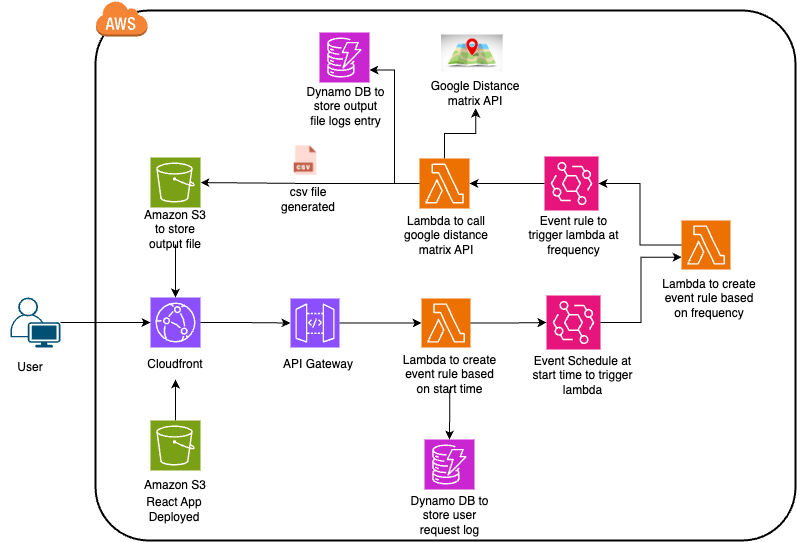

## **Project Overview**
This project is a UI-based application that leverages the Google Distance Matrix API to calculate the travel time between different locations based on user inputs. The application supports multiple modes of transportation (such as car, train, bus, etc.) and allows users to upload a CSV file containing a list of source and destination locations.

### **Key Features*:**

#### **User Input:**
- Users can select a start date, end date, and the frequency (in minutes) at which the travel times should be calculated.
- Modes of transportation can be chosen (e.g., car, train, bus).
- Users can upload a CSV file containing the source and destination locations.

#### **Automated Calculation:**
- Once the user submits the request, the system generates travel time data at regular intervals, based on the selected frequency. 
- The generated file contains the travel times between each source and destination location for the chosen date range.

#### **File Generation and Storage:**

The resulting files are generated periodically (every X minutes) and stored in an AWS S3 bucket.

### **AWS Architecture:**

### **Technology Stack:**
**Frontend**: UI React application for user input and CSV upload
**Backend:**
- AWS Lambda: Serverless compute for handling the requests
- AWS API Gateway: To expose the APIs for interaction with the UI
- AWS S3: For storing the generated travel time files
- AWS CloudFront: Content delivery and caching to enhance the UI's performance
Use Case:
The app is useful for anyone looking to track the time taken to travel between multiple locations over a period of time, using different modes of transport. It can be beneficial for logistics, travel planning, and route optimization.